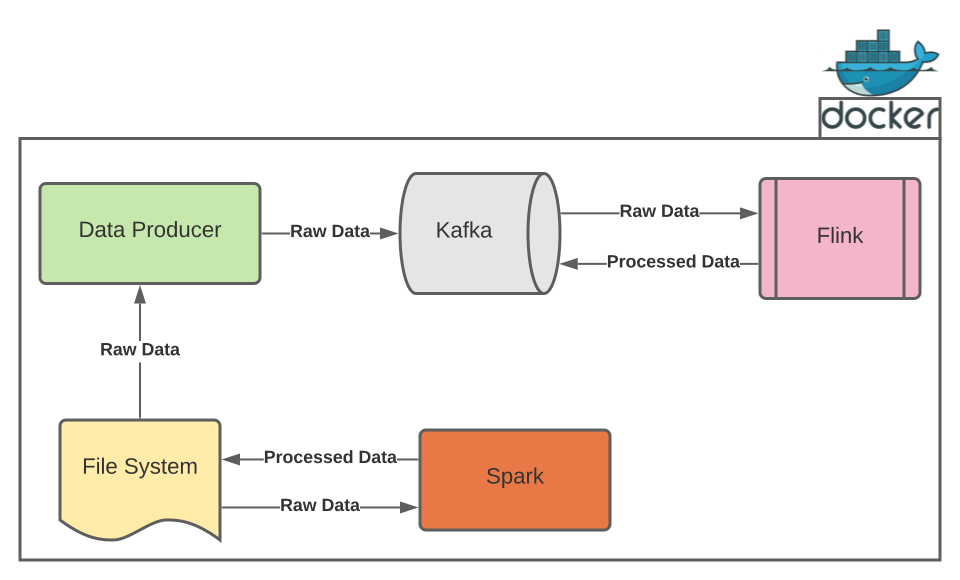
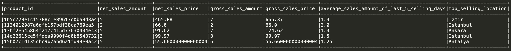

# Trendyol Data Engineering Technical Case

In this project, where you can test your data engineering skills, you will deal with problems that include the following jobs:
- Batch Processing
- Stream Processing



The diagram above shows an end-to-end Data Pipeline. Here are Data Producer, Kafka, Flink and Spark applications.

What we expect:

- Write batch Spark application(s) with data in file system.
- Write a Flink application using Kafka topics which is the DataProducer application writes data.
- **Do not use** SQL in this project.
- Develop the project using Scala.

## Problem Details

### **Data**

You will work on `orders` and `products` data. Here are their schemas:

```
orders
 |-- customer_id: string
 |-- location:    string
 |-- seller_id:   string
 |-- order_date:  string
 |-- order_id:    string
 |-- price:       double
 |-- product_id:  string
 |-- status:      string

products
 |-- brandname:    string
 |-- categoryname: string
 |-- productid:    string
 |-- productname:  string
```

You can `join` these two datasets like below:
```
orders.product_id = products.productid
```

### **Batch Processing**

Here you will deal with two different problems with Spark. You can solve these problems either with a single job or different jobs for each one, the design decision is up to you.

The essential process is to read the raw data from the file system, process them and write it back to the file system, you can write in which format you desired (CSV, JSON, etc.).

#### *Problem 1*

Calculate followings for each product and write the results to file system:
- Net sales amount and revenue (Total sales - cancellation / return)
- Gross sales amount and revenue (Total sales)
- Average number of sales that in the last 5 **sold days**
- Top selling location

You can see how last 5 sold days calculated for a product from the example below. If you pay attention, the last 5 sold days could be anytime, it does not have to be in consecutive days.

```
+------------+-------------------+
|product_id  |order_date         |
+------------+-------------------+
|<some-id-1> |2021-01-22 22:20:32|
|<some-id-1> |2020-12-23 13:50:20|
|<some-id-1> |2020-12-23 09:45:10|
|<some-id-1> |2021-01-14 07:57:24|
|<some-id-1> |2021-01-03 11:44:47|
|<some-id-1> |2021-01-03 14:34:43|
|<some-id-1> |2021-01-02 12:05:29|
+------------+-------------------+
```

At the end of the process, the columns and an example result could be as follows:



#### *Problem 2*

Extract the product-based price changes with their dates and write to the file system.

In given `orders` data, if the price of same `product_id` increased in next consecutive order you must denote as `rise` otherwise `fall`.

Input Example:

```
+-------------+------+-------------------+
|product_id   |price |order_date         |
+-------------+------+-------------------+
|<some-id-1>  |3.00  |2021-01-22 01:20:32|
|<some-id-1>  |3.00  |2021-01-22 02:50:20|
|<some-id-1>  |3.25  |2021-01-22 03:45:10|
|<some-id-2>  |3.25  |2021-01-22 13:45:10|
|<some-id-2>  |3.25  |2021-01-22 14:45:10|
|<some-id-2>  |3.45  |2021-01-22 15:45:10|
|<some-id-1>  |3.25  |2021-01-22 04:57:24|
|<some-id-1>  |2.99  |2021-01-22 05:44:47|
|<some-id-1>  |2.99  |2021-01-22 06:34:43|
|<some-id-1>  |3.50  |2021-01-22 07:05:29|
+-------------+------+-------------------+
```

Output Example:

```
+-------------+------+-------------------+--------+
|product_id   |price |order_date         |change  |
+-------------+------+-------------------+--------+
|<some-id-1>  |3.25  |2021-01-22 03:45:10|rise    |
|<some-id-1>  |2.99  |2021-01-22 05:44:47|fall    |
|<some-id-1>  |3.50  |2021-01-22 07:05:29|rise    |
|<some-id-2>  |3.45  |2021-01-22 15:45:10|rise    |
+-------------+------+-------------------+--------+
```

### **Stream Processing**

#### **Preparing the Data with Data Producer**

Here is how to run the DataProducer application to generate data for topics to be used as sources in your Flink application:

```
BOOTSTRAP_SERVERS=localhost:9092 BATCH_INTERVAL=100.millisecond BATCH_SIZE=100 ORDERS_SOURCE_PATH=raw-data/orders.json ORDERS_TOPIC=orders PRODUCTS_SOURCE_PATH=raw-data/products.json PRODUCTS_TOPIC=products java -jar DataProducer.jar com.trendyol.dataeng.bootcamp.DataProducer
```

You must deploy a Kafka Cluster before running DataProducer, deployment method is up to you.

#### **Problem**

Calculate the followings with grouping by location in every 5-minutes interval with Flink and write to a topic in Kafka:
- Number of different sellers
- Total sold products

After calculation you get the following fields, you can write this data to Kafka in JSON format:

```
seller_and_sold_product_counter
 |-- seller_count:  long
 |-- product_count: long
 |-- location:      string
 |-- date:          timestamp
```

`date` column should be in 5-minutes precision.

## Evaluation Criteria

- Performance
- Type Safety
- Code Quality
- Tests
- Spark
- Flink
- Documentation
